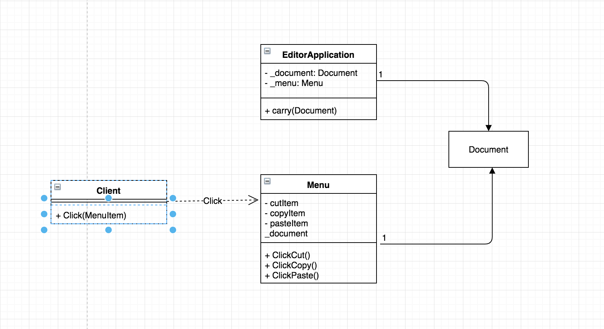
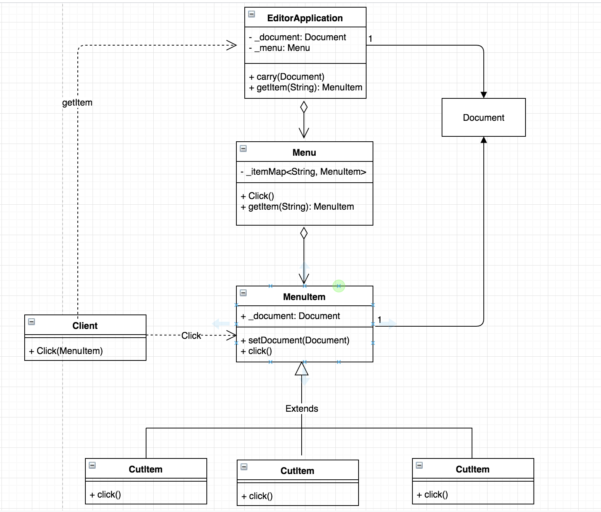

# CutCopyPaste
## Requirement
* An editor application carries a document.
* A menu in the editor application contains several menu items performing three specific operations: cut, copy and paste on a document when clicked.

## Class diagram
### Initial 

### Refactor


## SPEC
### Input
```
[operation]
…
```
### Output
```
// if [operation] is Cut
	Cut

// if [operation] is Copy
	Copying

// if [operation] is Paste
	Paste Done
```
### Comment
```
[operation] must be one of followings:
	Cut
	Copy
	Paste
You are asked to write a main function in Class Main
```
