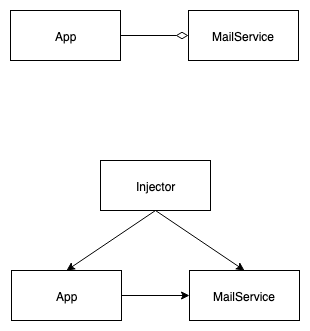

# A Simple Introduction and Example of Dependency Injection


> Transferring the task of creating the object to someone else and directly using the dependency is called dependency injection.

Dependency Injection has three type:
1. Constructor injection
2. Setter injection
3. Interface injection

## Exmample

Original implementation looks like this.
```java
public class App {
    private MailService mailService;
    public App() {
        this.mailService = new MailService();
    }
}

class MailService {
}

```

### Constructor

```java
public class App {
    private MailService mailService;
    public App(MailService ms) {
        this.mailService = ms;
    }
}

class MailService {
}

```

The injector code will be like this

```java
MailService ms = new MailService();
App app = new App(ms);
```

### Setter

Setter is almost the same as contructor version

```java
public class App {
    private MailService mailService;
    public App() {   
    }
  	public void setMailService(MailService ms) {
				this.mailService = ms;
    }
}

```

### Interface Injection

```java
public interface ServiceSetter {
  	public void setMailService(MailService service);
}

public class App implements ServiceSetter {
  	private MailService mailService;
  	@Override
  	public void setMailService(MailService ms) {
      this.mailService = ms;
    }
}
```

## Result




## Reference
- https://en.wikipedia.org/wiki/Dependency_injection
- https://medium.freecodecamp.org/a-quick-intro-to-dependency-injection-what-it-is-and-when-to-use-it-7578c84fa88f
