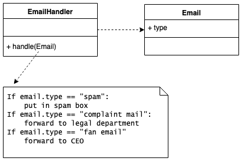
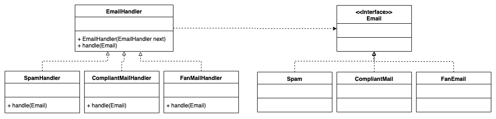

# Email Handler

## Design

### Initial



### Refactor



## Spec

### Input

```
[email_type]
…
```

### **Output**

```
//if [email_type] is SPAM
Put mail to the spam box.

//if [email_type] is COMPLAINT
Forward to legal department.

//if [email_type] is FAN
Forward to CEO.
```

### Comment

```
[email_type] must be one of followings:
	SPAM
	COMPLAINT
	FAN
You are asked to write a main function in Class Main
We'll test your program through "java Main inputFile"
e.g. java Main sampleInput
You should read input from file. 
And show output to standard output.

Sample input and output are in the folder.
```

