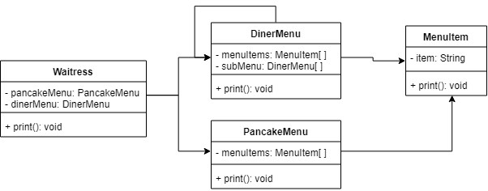
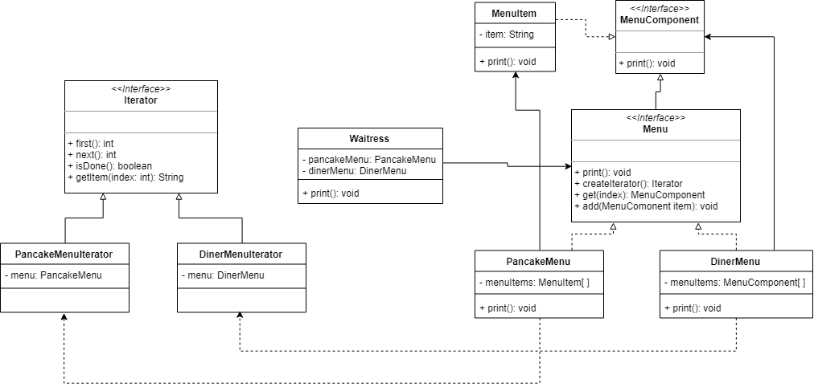

# Extended Merge of Two Menus

## Initial Design


## Refactor Design


## Spec
### Requirements Statements
* Based on the Merge Two Menus example
    * A waitress of Pancake House keeps a breakfast menu which uses an ArrayList to hold its menu items.
    * And a waitress of Diner keeps a lunch menu which uses an array to hold its menu items.
    * Now, these two restaurants are merged and intend to provide service in one place, so a waitress should keep both menus in hands.
    * The waitress would like to print two different menu representations at a time.
* A dessert submenu is added to the Diner menu.

### Input
```
/*
The order of PancakeHouse and Diner could be different from following example.
If SubMenu exists, it must follow Diner. It also means SubMenu    should not appear without Diner.
SubMenu could appear more than once or zero.
[menu_item] should be a string
*/


PancakeHouse
[menu_item]
…
Diner
[menu_item]
…
SubMenu
[menu_item]
…
```

### Output
```
/*
The order of PancakeHouse, Diner and SubMenu should be the same as following example.
MenuItem:[menu_item] should be shown with sequential order from input.
*/
PancakeHouseMenu:
MenuItem:[menu_item]
…
DinerMenu:
MenuItem:[menu_item]
…
SubMenu:
MenuItem:[menu_item]
…
```

### Comment
```
Output order must follow the Output format.

The sample input / output are in the folder.
You are asked to write a main function in Class Main
We'll test your program through "java Main inputFile"
e.g java Main sampleInput

You should read input from file.
And show output to standard output.
```
