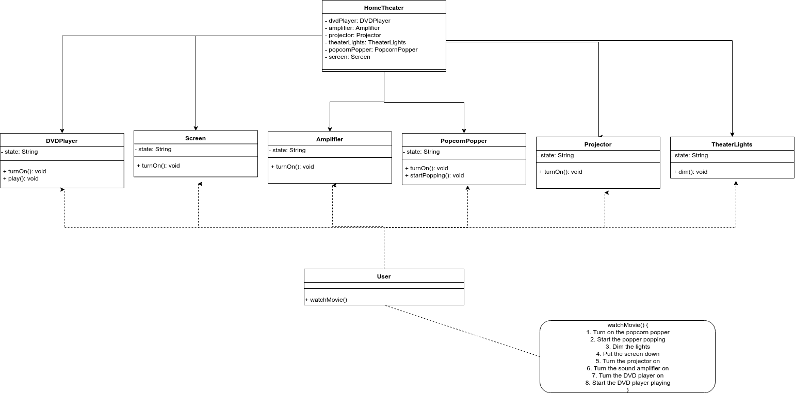
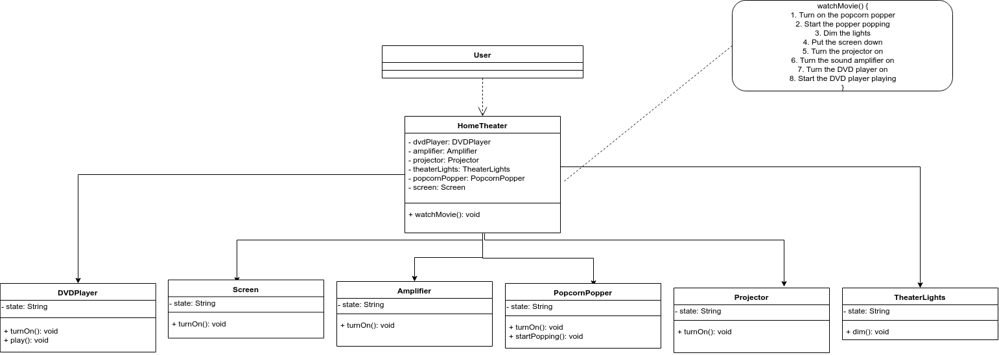

# Home Theater

## Initial Design


## Refactor Design


## Spec
### Requirements Statements
* A Home Theater consists of an amplifier, a DVD player, a projector, a screen, a popcorn popper, and theater lights.
* A user can watch a movie through the following process:
    * Turn on the popcorn popper
    * Start the popper popping
    * Dim the lights
    * Put the screen down
    * Turn the projector on
    * Turn the sound amplifier on
    * Turn the DVD player on
    * Start the DVD player playing

### Input
None

### Output
```
Turn on the popcorn popper
Start the popper popping
Dim the lights
Put the screen down
Turn the projector on
Turn the sound amplifier on
Turn the DVD player on
Start the DVD player playing
```

### Comment
```
You ae asked to write a main function in Class Main
We'll test your program through "java Main"
e.g java Main

There is no input for the program.
show output to standard output.
The sample output is in the folder.
```

## Author
Ya_Liang Chang (Allen) [amjtlc295](https://github.com/amjtlc295)
