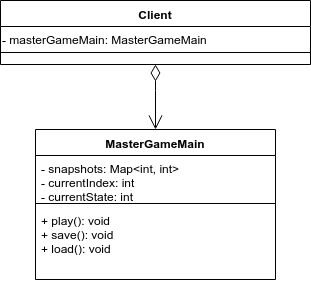
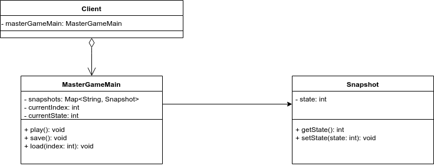

# Master Game

## Initial Design


## Refactor Design


## Requirements
* The main program of Master Game is MasterGameMain, and
the entry point is the play() operation.
* The current state of Master Game is also kept in
MasterGameMain.
* In order to provide save/load functionalities,
MasterGameMain should be able to store and restore the
snapshots of Master Game.

## SPEC
### Input:
play
save //save current [state_index] 
load [record_index]

### Output:
//show current state when input: play
Play~ Current State: [state_index]

// restore the state and show current state when input: load
Loadef __init__(self): Current State: [state_index]

### Comment:
```
[record_index] starts from 0.
[state_index] starts from 0. [state_index] increases while input: play.
     
     You are asked to write a main function in Class Main
     We'll test your program through "java Main inputFile"
     e.g. java Main sampleInput

     The sample input and output files are in the folder.

     You should read input from file. 
     And show output to standard output.
```

### Upload:
```
     Please push your source code to the master branch of your team’s homework Gitlab repository.
     The folder structure should be: 
        [dir] MasterGame
        =>  [dir] Team7
        =>       Main.java
        =>       *.java (optional) 
        =>       [name of test case].in
        =>       [name of test case].out

        You won’t receive any point if you didn’t follow the directory structure or main class name or compressed format!

```

## Author
Ya-Liang Chang [amjltc295](https:github.com/amjltc295)
