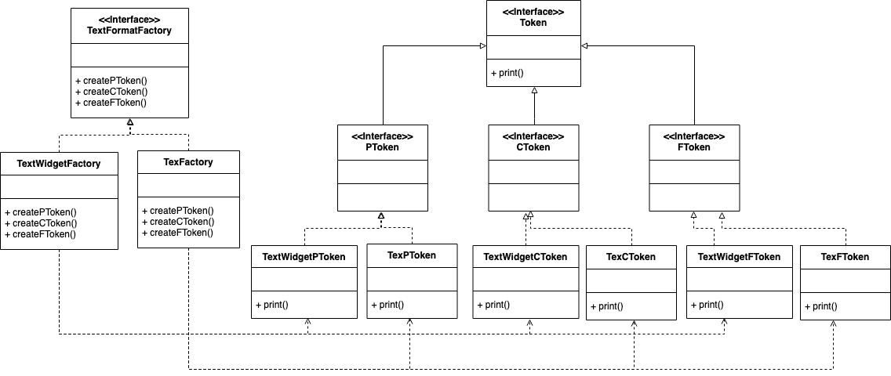

# RTF Converter

## Refactor Design



# Spec

## Requirements Statements
* A reader for the RTF (Rich Text Format) document exchange format should be able to convert RTF to many text formats.
* The reader converts RTF documents into TeX text or into a text widget by recognizing different RTF tokens (Character, Font Change and Paragraph).


## Input

```
[Text_format]
[TRF_token]
[Text_format]
[TRF_token]
...
```

## Output
```
/* 
if ([Text_format] is TeX)
{
	convert ‘C’to ‘c’
	convert ‘F’to ‘_’
	convert ‘P’ to ‘|’
}
else if ([Text_format] is TextWidget)
{
	convert ‘C’to ‘<Char>’
	convert ‘F’to ‘<Font>’
	convert ‘P’to ‘<Paragraph>’
}
*/

[converted_token]
```

## Comment
```
[Text_format] must be one of followings:
	TeX
	TextWidget
[TRF_token] must be one of followings:
	C
	F
	P
/*
C means Character
F means Font Change
P means Paragraph
*/

[converted_token] must be one of followings:
	c
	_
	|
	<Char>
	<Font>
	<Paragraph>

You are asked to write a main function in Class Main
We'll test your program through "java Main inputFile"
e.g java Main sampleInput

You should read input from file. 
And show output to standard output.
```