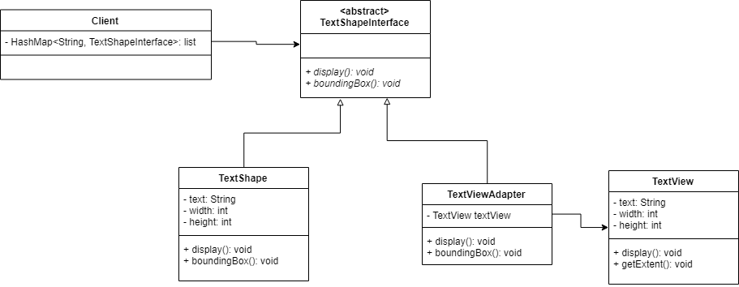

# TextShape

## Refactor Design


## Spec
### Requirements Statements
* A drawing editor 
    * Want to add a TextShape that using display method to display text and using boundingBox method to get bounding. 
* A drawing editor 
    * Meanwhile, an external library already provide a TextViewclass using display method to display text and using getExtentmethod to get bounding. 
    * We'd like to reuse TextViewto display text of shape.

### Input
```
3 kinds of command:
TextShape [shapeID] [text] [width] [height]
display [shapeID]
boundingBox [shapeID]
```

### Output
```
After display command:
Print “[text of shape]”
**[text of shape] = [text] from TextShape command with matching [shapeID]

After boundingBox command:
Print “Bounding box: width = [width of shape], height = [height of shape]”
**[width of shape] = [width] from TextShape command with matching [shapeID]
**[height of shape] = [height] from TextShape command with matching [shapeID]
```

### Comment
```
TextShape commands have distinct [shapeID].
Only [shapeID] that appeared in one of the previous TextShape commands will be used in display or boundingBox command.
[width] and [height] are integer.

You are asked to write a main function in Class Main
We'll test your program through "java Main inputFile"
e.g. java Main sampleInput

You should read input from file.
And show output to standard output.
```
