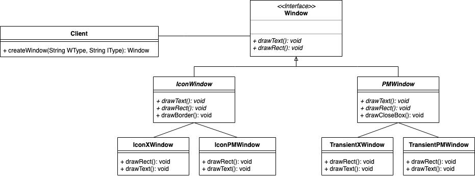
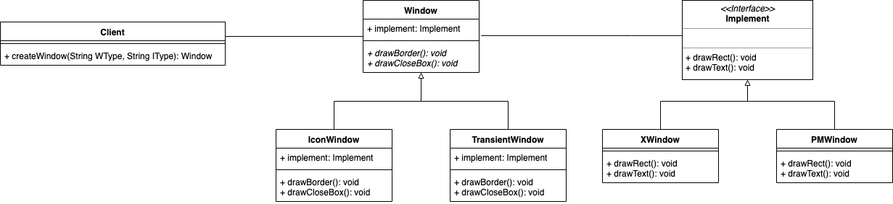

# Schematic Capture Systems

### Initial Design


### Refactor Design


## Spec
### Requirements Statements
In a window framework
- The two basic functionalities of a window are drawing text and drawing rectangles. 
- A window has two subtypes, Icon Window and Transient Window; Icon Window is able to draw a border by drawing rectangles and text while Transient Window is able to draw a close box by drawing rectangles.
- Both of the two windows can be implemented by X Window or Presentation Manager Window.


### Input
```
// 4 types of command
window [WindowSubtype] [ImplementType]
drawBorder
drawCloseBox
```

### Output
```
After window command: 
	Construct a window of subtype [WindowSubtype] implemented with [ImplementType]

[ImplementType] is XWindow:
	drawRect() => XXXX
	drawText() => XWindow

[ImplementType] is PMWindow:
	drawRect() => MMMM
	drawText() => PMWindow

After drawBorder command:
	drawText()
	drawRect()

After drawCloseBox command:
	drawRect()

```

### Comment
```
[WindowSubtype] is limited to "IconWindow" and "TransientWindow".
[ImplementType] is limited to "XWindow" and "PMWindow".

Please implement your main function in Class Main.
We'll test your program through "java Main inputFile"
e.g java Main sampleInput

Do not read input from System.in or hard code input file, or your program won’t pass any test case.
```
